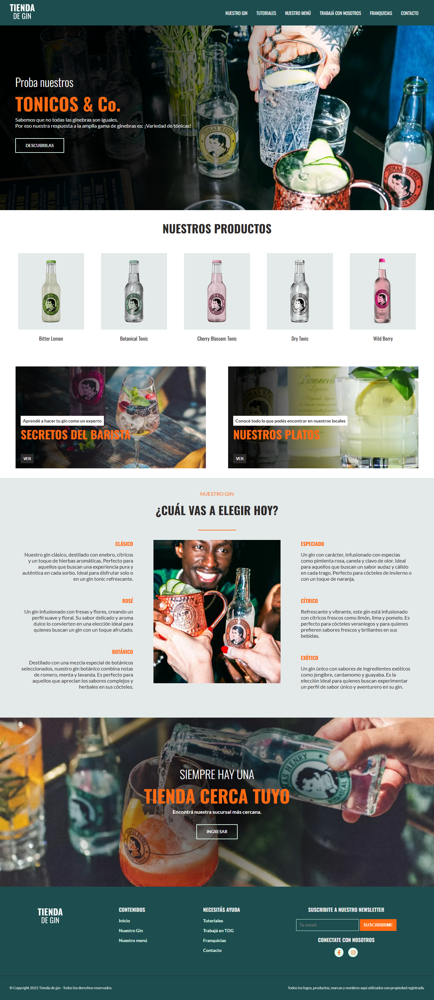

# Tienda de Gin

Este proyecto es un sitio web de una `Tienda de Gin`, diseñado para la materia `FrontEnd WEB` de carrera `Tecnicatura Superior en Desarrollo de Software`. Está construido utilizando HTML, CSS y JavaScript.

## Estructura del Proyecto

### Archivos principales

- **index.html**: Es el punto de entrada del sitio web, la página de inicio que proporciona una visión general de la tienda.
- **README.md**: Documento de descripción del proyecto, su estructura y guía de uso.

### Carpetas

- **views**: Contiene los archivos HTML de las distintas secciones del sitio, cada uno correspondiendo a una vista o página específica.
  - `contacto.html`: Página de contacto.
  - `franquicias.html`: Información sobre franquicias.
  - `our-gin.html`: Detalles sobre los distintos tipos de gin disponibles.
  - `our-menu.html`: El menú de la tienda.
  - `trabaja-en-tdg.html`: Página para oportunidades de trabajo.
  - `tutorials.html`: Tutoriales relacionados con la preparación del gin.

- **js**: Contiene los archivos JavaScript que gestionan la lógica de la web.
  - `home.js`: Script para manejar la página de inicio y sus elementos interactivos.
  - `our-gin.js`: Funcionalidades específicas para la página de gin.
  - `script.js`: Script principal para gestionar elementos globales de la web.
  - `show-elements.js`: Contiene funciones para mostrar elementos dinámicamente.
  - `tutorials.js`: Funcionalidades específicas para la página de tutoriales.
  - `utils.js`: Funciones de utilidad, carga imagenes para el home.

- **styles**: Contiene las hojas de estilo CSS.
  - `global.css`: Estilos globales aplicables a todo el sitio web. Contiene variables CSS utilizadas en todas las páginas.
  - `style.css`: Estilos principales que se aplican en todas las páginas, como el diseño del menú y el pie de página.
  - **views-style**: Carpeta que contiene los estilos específicos para cada vista o página en particular.

- **img**: Contiene las imágenes utilizadas en el sitio.
  - **common**: Imágenes comunes a todas las secciones, como el logo y otros elementos decorativos.
  - **home-cards, home-our-products, our-gin, our-menu, tutorials**: Carpetas con imágenes específicas para cada sección.
  - `favicon.ico`: Icon de la página.
  - `tienda-de-gin.png`: Logo de la tienda.

## Funcionalidades

- **Menú Hamburguesa**: Implementado en JavaScript para dispositivos móviles y pantallas pequeñas, el menú hamburguesa se despliega al hacer clic y se oculta al hacer clic fuera de él.
- **Carga Dinámica de Imágenes**: Las imágenes de productos y tutoriales se cargan dinámicamente en las páginas correspondientes mediante scripts JavaScript.
- **Transiciones y Efectos**: Las imágenes y otros elementos interactivos tienen efectos y transiciones suaves para mejorar la experiencia del usuario.

## Enlaces del Proyecto

- **Repositorio en GitHub**: [Repositorio FrontEnd Parcial 1](https://github.com/VCinthia/TSDS-FrontEnd-Parcial1)
- **Despliegue en Vercel**: [Vercel App](https://tiendadegin.vercel.app/)

## Tecnologías Utilizadas

- **HTML5**: Estructura y contenido del sitio web.
- **CSS3**: Estilos y diseño del sitio, utilizando variables globales y diseño responsivo.
- **JavaScript**: Funcionalidades dinámicas como el menú hamburguesa, carga de imágenes, y manejo de interactividad en cada vista.

